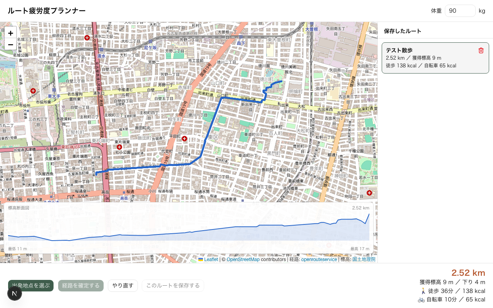

# ルート疲労度プランナー

[](https://github.com/nozaworld/walking-route-planner/actions/workflows/ci.yml)

地図上をクリックして描いた徒歩ルートについて，**距離・獲得標高・所要時間・消費カロリー**を，坂の勾配を考慮して見積もる Web アプリです．



## 主な機能

- **ルートを描く**：地図をクリックして経由点を打つと，道路に沿った徒歩ルートに変換します（OpenRouteService）．
- **標高断面図**：国土地理院の標高データから，ルートの起伏を断面図で表示します．
- **疲労度の見積もり**：勾配ごとの歩行エネルギーと歩行速度から，消費カロリーと所要時間を計算します．自転車で走った場合の概算も出します．
- **体重を反映**：体重を変えると，通信せずにその場で計算し直します．
- **ルートの保存**：名前を付けてブラウザに保存し，一覧からいつでも表示・削除できます．
- **スマホ対応**：狭い画面では地図・一覧・操作バーを縦に並べます．

## 計算モデル

ルートを約50点に間引き，隣り合う2点ごとの区間で勾配 *i*（標高差 ÷ 水平距離）を求めて積算します．

| 項目 | モデル |
|---|---|
| 歩行のエネルギーコスト | Minetti et al. (2002) の近似式 *C(i)* = 280.5*i*⁵ − 58.7*i*⁴ − 76.8*i*³ + 51.9*i*² + 19.6*i* + 2.5 [J/kg/m] |
| 歩行速度 | 平地 5 km/h．上りでも下りでも遅くなり，緩い下りが最も速い |
| 自転車 | 平地 15 km/h を基準とした簡易モデル（車体 10 kg を含む） |

消費カロリー = Σ（区間距離 × *C(i)* × 体重）÷ 4184 です．式は `lib/energy-model.ts` にあります．

## 技術構成

| 分類 | 使っているもの |
|---|---|
| フレームワーク | Next.js 16（App Router），React 19，TypeScript |
| UI | Tailwind CSS v4，shadcn/ui（Base UI），lucide-react，sonner |
| 地図 | Leaflet，react-leaflet，OpenStreetMap |
| 外部 API | OpenRouteService（徒歩ルート），国土地理院 標高 API |
| 入力検証 | zod |
| テスト | Vitest（ユニット），Playwright（E2E） |
| Lint・整形 | Biome |
| CI | GitHub Actions |
| 公開 | Vercel |

### 処理の流れ

```
ブラウザ ──経由点──▶ POST /api/plan（Route Handler）
                       ├─ OpenRouteService：経由点を1回のリクエストで徒歩ルートに変換
                       └─ 国土地理院：ルートを50点に間引き，標高を10本ずつ並列に取得（キャッシュあり）
ブラウザ ◀──経路と標高── 
  └─ 体重を使って消費カロリーと所要時間を計算し，地図・断面図・統計を描く
```

API キーはサーバー側の Route Handler でのみ使い，ブラウザには渡しません．

### ディレクトリ構成

```
app/
  page.tsx                  トップページ
  api/plan/route.ts         経路と標高を返す API
components/planner/         画面の部品（地図，断面図，統計，保存一覧，保存ダイアログ）
lib/
  geo.ts                    距離計算と点列の間引き
  energy-model.ts           エネルギー・速度モデルと統計の計算
  plan.ts                   API の入出力の型と検証スキーマ
  storage.ts                localStorage への保存
  server/                   OpenRouteService と国土地理院の呼び出し（サーバー専用）
tests/                      Playwright の E2E テスト
.github/workflows/ci.yml    CI（GitHub Actions）
docs/design.md              設計書
```

## 手元で動かす

Node.js 22.22 以上（または 24.15 以上）が必要です．

```bash
npm install
cp .env.example .env   # ORS_API_KEY を書き込む
npm run dev            # http://localhost:3000
```

### 環境変数

| 変数 | 必須 | 説明 |
|---|---|---|
| `ORS_API_KEY` | ✅ | [OpenRouteService](https://openrouteservice.org/) の API キー．無料枠は経路探索 2,000回/日 |
| `DATABASE_URL` | | Postgres の接続先（ログイン・DB 保存の実装後に使う） |
| `BETTER_AUTH_SECRET` / `BETTER_AUTH_URL` | | 認証の設定（同上） |

### スクリプト

| コマンド | 内容 |
|---|---|
| `npm run dev` | 開発サーバーを起動 |
| `npm run build` / `npm run start` | 本番ビルドと起動 |
| `npm test` | Vitest でユニットテスト |
| `npm run e2e` | Playwright で E2E テスト（API は差し替えるのでキー不要） |
| `npm run lint` / `npm run format` | Biome でチェック・整形 |
| `npm run typecheck` | TypeScript の型チェック |

## CI

`main` への push とプルリクエストごとに，GitHub Actions（`.github/workflows/ci.yml`）で次を確かめます．

| ジョブ | 内容 |
|---|---|
| Lint・型チェック・ユニットテスト | `biome ci`，`tsc --noEmit`，`vitest run` |
| ビルド・E2E テスト | `next build` のあと，本番サーバーに対して Playwright で Chromium・Firefox・WebKit のテスト |

E2E テストでは経路計算 API の応答を差し替えるので，CI に API キーを登録する必要はありません．

## 旧版からの改善

このアプリは，素の JavaScript で書いた旧版（`_prev/`）を Next.js に移植したものです．移植の際に次の点を直しました．

- **徒歩ルートの修正**：旧版の経路探索（OSRM のデモサーバー）は `foot` の指定を無視して車のルートを返していたため，OpenRouteService の徒歩ルートに置き換えました．
- **高速化**：外部 API を最大110回順番に呼んでいたのを，経路は1回，標高は並列取得にしました．
- **体重の変更**：変更するたびに標高を取り直していたのを，取得済みのデータで計算し直すだけにしました．
- **細かな不具合**：間引きで終点が欠ける，59.6分が「60分」と表示される，欠けた標高を 0m 扱いして断面図に段差ができる，を修正しました．

## 今後の予定

- ログインと DB へのルート保存，URL での共有
- 「最短」と「いちばん楽」なルートの比較
- 勾配でルートを色分けし，断面図と地図の位置を連動
- 目標の消費カロリーや時間から周回ルートを作る逆算モード
- 自転車用ルートでの計算

## クレジット

- 地図：© [OpenStreetMap](https://www.openstreetmap.org/copyright) contributors
- 経路探索：[openrouteservice](https://openrouteservice.org/)（HeiGIT）
- 標高：[国土地理院 標高 API](https://maps.gsi.go.jp/development/elevation_s.html)
- 歩行エネルギーモデル：Minetti, A. E. et al. (2002). Energy cost of walking and running at extreme uphill and downhill slopes. *Journal of Applied Physiology*, 93(3), 1039–1046.
