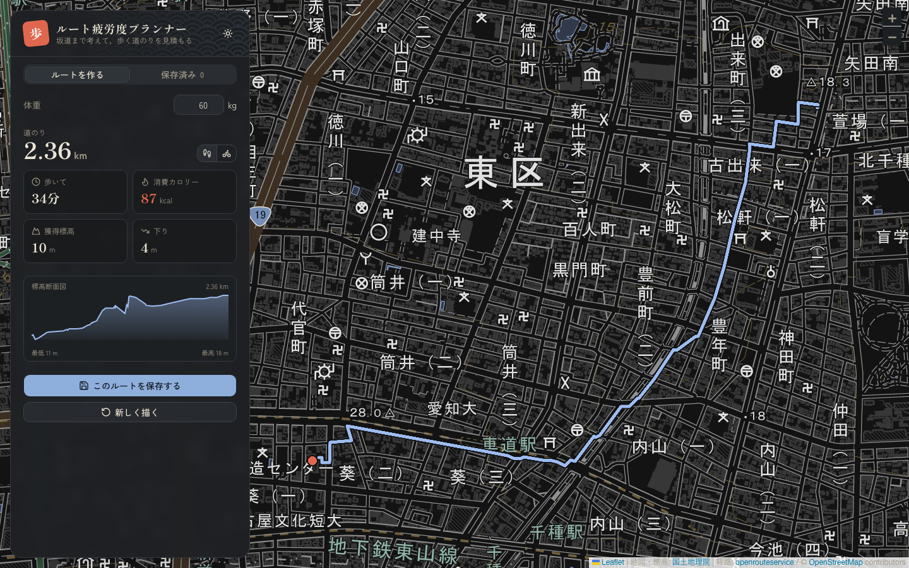
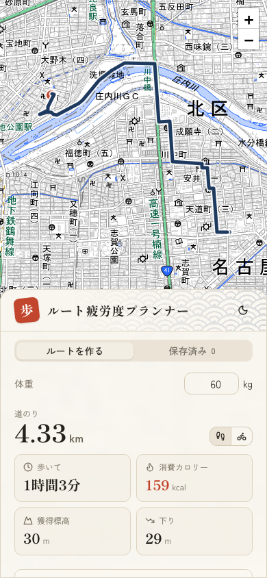

# ルート疲労度プランナー

[](https://github.com/nozaworld/walking-route-planner/actions/workflows/ci.yml)

地図上をクリックして描いた徒歩ルートについて，**距離・獲得標高・所要時間・消費カロリー**を，坂の勾配を考慮して見積もる Web アプリです．

**デモ**：https://walking-route-planner-inky.vercel.app/


| 暗い表示 | スマホ |
|---|---|
|  |  |

## 主な機能

- **地名検索**：地名・駅名・施設名で探すと，その場所へ地図が移動します．今見ている地域の近くの候補を先に並べます．
- **ルートを描く**：地図をクリックして経由点を打つと，道路に沿った徒歩ルートに変換します（OpenRouteService）．打ち間違えた点は「ひとつ戻す」で取り消せます．
- **手順の案内**：「一 出発地点 → 二 道をたどる → 三 確定」のどこにいるかを示し，その段階で押すボタンだけを出します．
- **標高断面図**：国土地理院の標高データから，ルートの起伏を断面図で表示します．カーソルを合わせた地点の距離と標高がわかります．
- **疲労度の見積もり**：勾配ごとの歩行エネルギーと歩行速度から，消費カロリーと所要時間を計算します．徒歩と自転車を切り替えて表示できます．
- **体重を反映**：体重を変えると，通信せずにその場で計算し直します．
- **ルートの保存**：名前を付けて保存し，一覧からいつでも表示・削除できます．ログインしなければブラウザに，ログインするとクラウド（Postgres）に保存します．
- **ログイン**：メールアドレスとパスワードで登録・ログインできます．ブラウザに保存していたルートは，ログイン後にまとめてアカウントへ取り込めます．
- **URL で共有**：保存したルートを「共有中」にすると，`/r/[id]` の URL でログインしていない人も見られます．見る人の体重で消費カロリーを計算し直します．
- **利用回数の制限**：経路計算と地名検索は，IP ごと・アプリ全体の回数を数え，外部 API の無料枠を使い切られないようにしています．
- **和風モダンのデザイン**：生成り・墨・藍・朱の配色，明朝体の数字，青海波の文様．暗い表示にも対応します．
- **滑らかな拡大縮小**：地図を MapLibre GL（WebGL）で描くので，ホイールやピンチに合わせて連続的に拡大縮小し，読み込み中も画面が白く抜けません．
- **パネルの大きさを変更**：操作パネルの端をドラッグすると，幅（PC）や高さ（スマホ）を変えられます．大きさは次回も保たれます．
- **スマホ対応**：PC では操作パネルを地図の左に，スマホでは下に重ねます．

## 計算モデル

ルートを約50点に間引き，隣り合う2点ごとの区間で勾配 *i*（標高差 ÷ 水平距離）を求めて積算します．

| 項目 | モデル |
|---|---|
| 歩行のエネルギーコスト | Minetti et al. (2002) の近似式 *C(i)* = 280.5*i*⁵ − 58.7*i*⁴ − 76.8*i*³ + 51.9*i*² + 19.6*i* + 2.5 [J/kg/m] |
| 歩行速度 | 平地 5 km/h．上りでも下りでも遅くなり，緩い下りが最も速い |
| 自転車 | 平地 15 km/h を基準とした簡易モデル（車体 10 kg を含む） |

消費カロリー = Σ（区間距離 × *C(i)* × 体重）÷ 4184 です．式は `lib/energy-model.ts` にあります．

## 技術構成

| 分類 | 使っているもの |
|---|---|
| フレームワーク | Next.js 16（App Router），React 19，TypeScript |
| UI | Tailwind CSS v4，shadcn/ui（Base UI），lucide-react，sonner，next-themes |
| フォント | Zen Kaku Gothic New（本文），しっぽり明朝（見出し・数字） |
| 地図 | MapLibre GL JS，@vis.gl/react-maplibre，国土地理院 淡色地図 |
| 外部 API | OpenRouteService（徒歩ルート・地名検索），国土地理院 標高 API |
| DB | Neon（Postgres），Drizzle ORM，postgres.js |
| 認証 | better-auth（メールアドレスとパスワード） |
| 入力検証 | zod |
| テスト | Vitest（ユニット），Playwright（E2E） |
| Lint・整形 | Biome |
| CI | GitHub Actions |
| 公開 | Vercel |

### 処理の流れ

```
ブラウザ ──経由点──▶ POST /api/plan（Route Handler）
                       ├─ OpenRouteService：経由点を1回のリクエストで徒歩ルートに変換
                       └─ 国土地理院：ルートを50点に間引き，標高を10本ずつ並列に取得（キャッシュあり）
ブラウザ ◀──経路と標高── 
  └─ 体重を使って消費カロリーと所要時間を計算し，地図・断面図・統計を描く

ブラウザ ──ログイン・保存・共有──▶ /api/auth/*，/api/routes/*（Route Handler）──▶ Neon（Postgres）
```

API キーと DB の接続情報はサーバー側の Route Handler でのみ使い，ブラウザには渡しません．
`/api/plan` と `/api/geocode` は，外部 API を呼ぶ前に `api_usage` テーブルで利用回数を数えます．

### テーブル

| テーブル | 内容 |
|---|---|
| `user`，`session`，`account`，`verification`，`rate_limit` | ログイン用（better-auth の CLI で生成） |
| `routes` | 保存したルート（座標・断面図用の標高・統計・共有の有無） |
| `api_usage` | API の利用回数（キーと時間の窓ごと） |

設計の詳細は [`docs/db-phase.md`](docs/db-phase.md) にあります．

### ディレクトリ構成

```
app/
  page.tsx                  トップページ
  r/[id]/page.tsx           ルートの共有ページ
  api/plan/route.ts         経路と標高を返す API
  api/geocode/route.ts      地名検索の API
  api/auth/[...all]/        ログインの API（better-auth）
  api/routes/               保存ルートの API（一覧・保存・取り込み・共有の切り替え・削除）
components/
  planner/                  トップページの部品（地図，操作パネル，ログイン，統計，断面図，保存一覧など）
  shared/                   共有ページの部品
db/                         テーブル定義（Drizzle）
drizzle/                    マイグレーションの SQL（drizzle-kit で生成）
lib/
  geo.ts                    距離計算と点列の間引き
  energy-model.ts           エネルギー・速度モデルと統計の計算
  plan.ts，geocode.ts，routes.ts   API の入出力の型と検証スキーマ
  storage.ts                localStorage への保存
  auth-client.ts            画面側のログインのクライアント
  server/                   サーバー専用（DB，認証，保存ルート，利用回数の制限，ORS・国土地理院の呼び出し）
tests/                      Playwright の E2E テスト
bruno/                      Bruno の API テスト（経路計算・地名検索・ログイン・保存ルート・共有ページ）
.github/workflows/ci.yml    CI（GitHub Actions）
docs/                       設計書（design.md：移植，db-phase.md：DB フェーズ）
```

## 手元で動かす

Node.js 22.22 以上（または 24.15 以上）が必要です．

```bash
npm install
cp .env.example .env   # ORS_API_KEY・DATABASE_URL・BETTER_AUTH_SECRET などを書き込む
npm run db:migrate     # テーブルを作る
npm run dev            # http://localhost:3000
```

### 環境変数

| 変数 | 必須 | 説明 |
|---|---|---|
| `ORS_API_KEY` | ✅ | [OpenRouteService](https://openrouteservice.org/) の API キー．無料枠は経路探索 2,000回/日，地名検索 1,000回/日（1回の検索で「近く」と「全国」の2回分を使う） |
| `DATABASE_URL` | ✅ | Postgres の接続先（コネクションプーリング経由）．アプリが使う |
| `DATABASE_URL_UNPOOLED` | ✅ | Postgres への直接の接続．マイグレーション（drizzle-kit）が使う |
| `BETTER_AUTH_SECRET` | ✅ | ログインのセッションの署名に使う秘密鍵（`openssl rand -base64 32` などで作る） |
| `BETTER_AUTH_URL` | ✅ | アプリの URL（手元は `http://localhost:3000`）．Vercel のプレビュー環境では `VERCEL_URL` から自動で作る |

Vercel では，Neon の連携（Marketplace）で `DATABASE_URL` などが自動で登録されます．

### スクリプト

| コマンド | 内容 |
|---|---|
| `npm run dev` | 開発サーバーを起動 |
| `npm run build` / `npm run start` | 本番ビルドと起動 |
| `npm test` | Vitest でユニットテスト |
| `npm run e2e` | Playwright で E2E テスト（API は差し替えるのでキー不要） |
| `npm run api-test` | Bruno で API テスト（`bruno/`．開発サーバーを起動してから実行．ORS を3回分使い，作ったテスト用アカウントは最後に消す） |
| `npm run lint` / `npm run format` | Biome でチェック・整形 |
| `npm run typecheck` | ルートの型を生成（`next typegen`）してから TypeScript の型チェック |
| `npm run db:generate` | テーブル定義の変更からマイグレーションの SQL を作る |
| `npm run db:migrate` | マイグレーションを DB に適用する |
| `npm run db:studio` | Drizzle Studio で DB の中身を見る |
| `npm run vercel-build` | Vercel が使うビルド（マイグレーションを適用してからビルド） |

## CI

`main` への push とプルリクエストごとに，GitHub Actions（`.github/workflows/ci.yml`）で次を確かめます．

| ジョブ | 内容 |
|---|---|
| Lint・型チェック・ユニットテスト | `biome ci`，`tsc --noEmit`，`vitest run` |
| ビルド・E2E テスト | `next build` のあと，本番サーバーに対して Playwright で Chromium・WebKit のテスト（Firefox は CI に GPU がなく WebGL が使えないため手元でのみ） |

E2E テストでは経路計算・ログイン・保存ルートの API の応答を差し替えるので，CI に API キーや DB を用意する必要はありません．

## 旧版からの改善

このアプリは，素の JavaScript で書いた旧版（`_prev/`）を Next.js に移植したものです．移植の際に次の点を直しました．

- **徒歩ルートの修正**：旧版の経路探索（OSRM のデモサーバー）は `foot` の指定を無視して車のルートを返していたため，OpenRouteService の徒歩ルートに置き換えました．
- **高速化**：外部 API を最大110回順番に呼んでいたのを，経路は1回，標高は並列取得にしました．
- **体重の変更**：変更するたびに標高を取り直していたのを，取得済みのデータで計算し直すだけにしました．
- **細かな不具合**：間引きで終点が欠ける，59.6分が「60分」と表示される，欠けた標高を 0m 扱いして断面図に段差ができる，を修正しました．

## 今後の予定

- 「最短」と「いちばん楽」なルートの比較
- 勾配でルートを色分けし，断面図と地図上の位置を連動
- 目標の消費カロリーや時間から周回ルートを作る逆算モード
- 自転車用ルートでの計算
- GitHub などの外部サービスでのログイン，パスワードの再設定

## クレジット

- 地図：[国土地理院 地理院タイル（淡色地図）](https://maps.gsi.go.jp/development/ichiran.html)
- 経路探索：[openrouteservice](https://openrouteservice.org/)（HeiGIT），経路データ © [OpenStreetMap](https://www.openstreetmap.org/copyright) contributors
- 標高：[国土地理院 標高 API](https://maps.gsi.go.jp/development/elevation_s.html)
- 青海波の文様：Lea Verou「CSS3 Patterns Gallery」の Seigaiha を元に作成
- 歩行エネルギーモデル：Minetti, A. E. et al. (2002). Energy cost of walking and running at extreme uphill and downhill slopes. *Journal of Applied Physiology*, 93(3), 1039–1046.
